```{r setup, include=FALSE}
knitr::opts_chunk$set(echo = TRUE)
```

# Introduction {#sec:intro}
This report uses **bookdown** or **rmarkdown** to produce a report for considering approximation of the distribution function of $N(0, 1)$ by the Monte Carlo methods, and do a Experiment with the approximation at $n \in \{10^2, 10^3, 10^4\}$ at $t \in \{0.0, 0.67, 0.84, 1.28, 1.65, 2.32, 2.58, 3.09, 3.72\}$ to form a table. And  Draw box plots of the 100 approximation errors at each $t$ using **ggplot2** [@R-ggplot2] for each $n$.

# Math Equations {#sec:math}

Consider approximation of the distribution function of $N(0, 1)$,

\begin{equation}
\Phi(t) = \int_{-\infty}^t \frac{1}{\sqrt{2\pi}} e^{-y^2 / 2}dy,
(\#eq:cdf)
\end{equation}
by the Monte Carlo methods:
\begin{equation}
\hat\Phi(t) = \frac{1}{n} \sum_{i=1}^n I(X_i \le t),
\end{equation}
where $X_i$'s are a random sample from $N(0, 1)$, and $I(\cdot)$ is
the indicator function. 

# Experimentation and Result

Experiment with the approximation at $n \in \{10^2, 10^3, 10^4\}$ at $t \in \{0.0, 0.67, 0.84, 1.28, 1.65, 2.32, 2.58, 3.09, 3.72\}$ to form a table.

Form a table

```{r}
t=c(0.0,0.67, 0.84,1.28,1.65,2.32,2.58,3.09,3.72)

n1=100
w1=matrix(0,9,100)
x1=vector("numeric",9)
y1=c(rnorm(100,0,1))

for (i in 1:9) 
  {for(j in 1:100)
    {w1[i,j]=sign(y1[j]<=t[i])}
  x1[i]=sum(w1[i,])/100}

n2=1000
w2=matrix(0,9,1000)
x2=vector("numeric",9)
y2=c(rnorm(1000,0,1))

for (i in 1:9) {
  for(j in 1:1000){
    w2[i,j]=sign(y2[j]<=t[i])
  }
  x2[i]=sum(w2[i,])/1000
}

n3=10000
w3=matrix(0,9,10000)
x3=vector("numeric",9)
y3=c(rnorm(100,0,1))

for (i in 1:9) {
  for(j in 1:10000){
    w3[i,j]=sign(y3[j] <= t[i])
  }
  x3[i]=sum(w1[i,])/10000
}

x4=pnorm(c(0.0, 0.67, 0.84, 1.28, 1.65, 2.32, 2.58, 3.09, 3.72),0,1)
x=data.frame(R.100=x1,R.1000=x2,R.10000=x3,True_value=x4)
colnames=c("n=100","n=1000","n=10000","True_value")
rownames=c("t=0","t=0.67","t=0.84","t=1.28","t=1.65","t=2.32","t=2.58","t=3.09","t=3.72")
dimnames(x)=list(rownames,colnames)
x

```
Repeat the experiment 100 times

```{r}
n1=100
rp100_100<-function(){
  n1=100
  w1=matrix(0,9,100)
  x1=vector("numeric",9)
  y1=c(rnorm(100,0,1))

for (i in 1:9) {
  for(j in 1:100){
    w1[i,j]=sign(y1[j]<=t[i])
  }
  x1[i]=sum(w1[i,])/100
}
  return(x1)
}
m1=matrix(0,100,9)
for(i in 1:100)
    m1[i,]=rp100_100()
m1
 
n2=1000
rp100_1000<-function(){
  n2=1000
  w2=matrix(0,9,1000)
  x2=vector("numeric",9)
  y2=c(rnorm(1000,0,1))

for (i in 1:9) {
  for(j in 1:1000){
    w2[i,j]=sign(y2[j]<=t[i])
  }
  x2[i]=sum(w2[i,])/1000
}
  return(x2)
}
m2=matrix(0,100,9)
for(i in 1:100)
    m2[i,]=rp100_100()
m2

n3=10000
rp100_10000<-function(){
  n3=10000
  w3=matrix(0,9,10000)
  x3=vector("numeric",9)
  y3=c(rnorm(10000,0,1))

for (i in 1:9) {
  for(j in 1:10000){
    w3[i,j]=sign(y3[j]<=t[i])
  }
  x3[i]=sum(w3[i,])/10000
}
  return(x3)
}
m3=matrix(0,100,9)
for(i in 1:100)
    m3[i,]=rp100_100()
m3

```
the 100 approximation errors
```{r}
n=100
e100_1=m1[,1]-c(rep(pnorm(0,0,1),100))
e100_2=m1[,2]-c(rep(pnorm(0.67,0,1),100))
e100_3=m1[,3]-c(rep(pnorm(0.84,0,1),100))
e100_4=m1[,4]-c(rep(pnorm(1.28,0,1),100))
e100_5=m1[,5]-c(rep(pnorm(1.65,0,1),100))
e100_6=m1[,6]-c(rep(pnorm(2.32,0,1),100))
e100_7=m1[,7]-c(rep(pnorm(2.58,0,1),100))
e100_8=m1[,8]-c(rep(pnorm(3.09,0,1),100))
e100_9=m1[,9]-c(rep(pnorm(3.72,0,1),100))

n=1000
e1000_1=m2[,1]-c(rep(pnorm(0,0,1),100))
e1000_2=m2[,2]-c(rep(pnorm(0.67,0,1),100))
e1000_3=m2[,3]-c(rep(pnorm(0.84,0,1),100))
e1000_4=m2[,4]-c(rep(pnorm(1.28,0,1),100))
e1000_5=m2[,5]-c(rep(pnorm(1.65,0,1),100))
e1000_6=m2[,6]-c(rep(pnorm(2.32,0,1),100))
e1000_7=m2[,7]-c(rep(pnorm(2.58,0,1),100))
e1000_8=m2[,8]-c(rep(pnorm(3.09,0,1),100))
e1000_9=m2[,9]-c(rep(pnorm(3.72,0,1),100))

n=10000
e10000_1=m3[,1]-c(rep(pnorm(0,0,1),100))
e10000_2=m3[,2]-c(rep(pnorm(0.67,0,1),100))
e10000_3=m3[,3]-c(rep(pnorm(0.84,0,1),100))
e10000_4=m3[,4]-c(rep(pnorm(1.28,0,1),100))
e10000_5=m3[,5]-c(rep(pnorm(1.65,0,1),100))
e10000_6=m3[,6]-c(rep(pnorm(2.32,0,1),100))
e10000_7=m3[,7]-c(rep(pnorm(2.58,0,1),100))
e10000_8=m3[,8]-c(rep(pnorm(3.09,0,1),100))
e10000_9=m3[,9]-c(rep(pnorm(3.72,0,1),100))

A=cbind.data.frame(e100_1,e100_2,e100_3,e100_4,e100_5,e100_6,e100_7,e100_8,e100_9,e1000_1,e1000_2,e1000_3,e1000_4,e1000_5,e1000_6,e1000_7,e1000_8,e1000_9,e10000_1,e10000_2,e10000_3,e10000_4,e10000_5,e10000_6,e10000_7,e10000_8,e10000_9)

```

Box plots of the 100 approximation errors at each $t$ using **ggplot2** [@R-ggplot2] for each $n$.

```{r}
library(ggplot2)

plot1<-ggplot(data=A,aes(y=e100_1,x="0-100"))+geom_boxplot(
    fill="thistle",colour="gray27")+geom_point()+
    labs(title="Boxplot of error at t=0, n=100",y="error",
         x=NULL)+theme(plot.title=element_text(size=13,hjust=0.5))
plot1

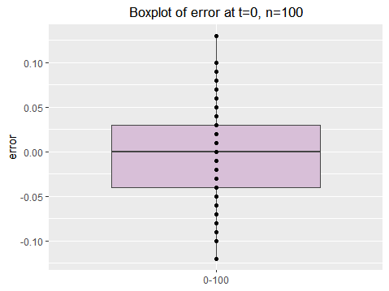

plot2<-ggplot(data=A,aes(y=e100_2,x="0.67-100"))+geom_boxplot(
    fill="thistle",colour="gray27")+geom_point()+
    labs(title="Boxplot of error at t=0.67, n=100",y="error",
         x=NULL)+theme(plot.title=element_text(size=13,hjust=0.5))
plot2

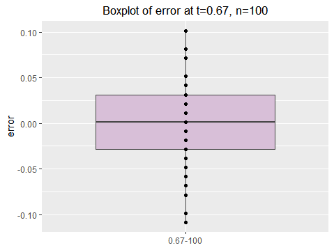

plot3<-ggplot(data=A,aes(y=e100_3,x="0.84-100"))+geom_boxplot(
    fill="thistle",colour="gray27")+geom_point()+
    labs(title="Boxplot of error at t=0.84, n=100",y="error",
         x=NULL)+theme(plot.title=element_text(size=13,hjust=0.5))
plot3

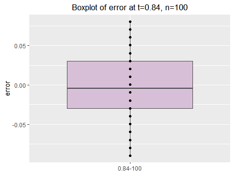

plot4<-ggplot(data=A,aes(y=e100_4,x="1.28-100"))+geom_boxplot(
    fill="thistle",colour="gray27")+geom_point()+
    labs(title="Boxplot of error at t=1.28, n=100",y="error",
         x=NULL)+theme(plot.title=element_text(size=13,hjust=0.5))
plot4

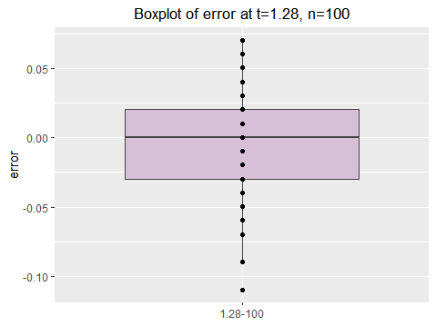

plot5<-ggplot(data=A,aes(y=e100_5,x="1.65-100"))+geom_boxplot(
    fill="thistle",colour="gray27")+geom_point()+
    labs(title="Boxplot of error at t=1.65, n=100",y="error",
         x=NULL)+theme(plot.title=element_text(size=13,hjust=0.5))
plot5

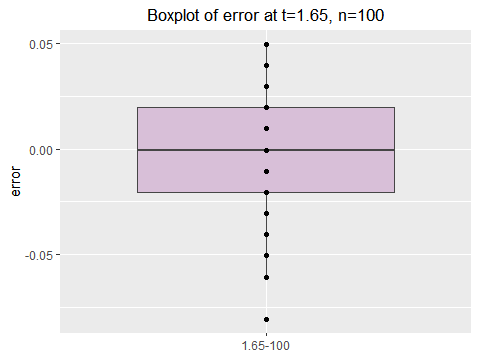

plot6<-ggplot(data=A,aes(y=e100_6,x="2.32-100"))+geom_boxplot(
    fill="thistle",colour="gray27")+geom_point()+
    labs(title="Boxplot of error at t=2.32, n=100",y="error",
         x=NULL)+theme(plot.title=element_text(size=13,hjust=0.5))
plot6

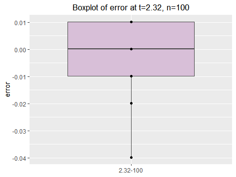

plot7<-ggplot(data=A,aes(y=e100_7,x="2.58-100"))+geom_boxplot(
    fill="thistle",colour="gray27")+geom_point()+
    labs(title="Boxplot of error at t=2.58, n=100",y="error",
         x=NULL)+theme(plot.title=element_text(size=13,hjust=0.5))
plot7

knitr::include_graphics("plot/Rplot7.png")

plot8<-ggplot(data=A,aes(y=e100_8,x="3.09-100"))+geom_boxplot(
    fill="thistle",colour="gray27")+geom_point()+
    labs(title="Boxplot of error at t=3.09, n=100",y="error",
         x=NULL)+theme(plot.title=element_text(size=13,hjust=0.5))
plot8

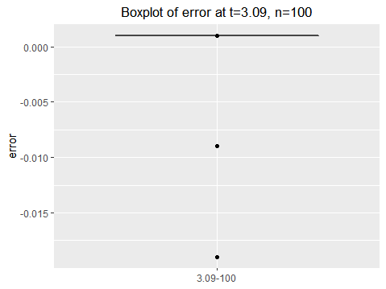

plot9<-ggplot(data=A,aes(y=e100_9,x="3.72-100"))+geom_boxplot(
    fill="thistle",colour="gray27")+geom_point()+
    labs(title="Boxplot of error at t=3.72, n=100",y="error",
         x=NULL)+theme(plot.title=element_text(size=13,hjust=0.5))
plot9

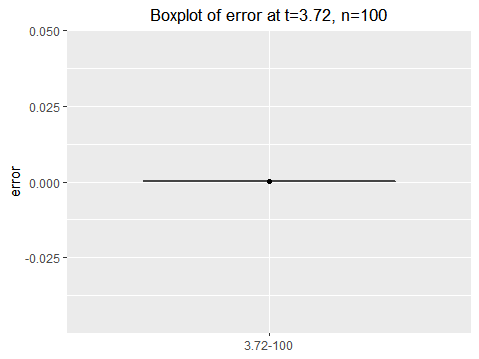

plot10<-ggplot(data=A,aes(y=e1000_1,x="0-100"))+geom_boxplot(
    fill="thistle",colour="gray27")+geom_point()+
    labs(title="Boxplot of error at t=0, n=100",y="error",
         x=NULL)+theme(plot.title=element_text(size=13,hjust=0.5))
plot10

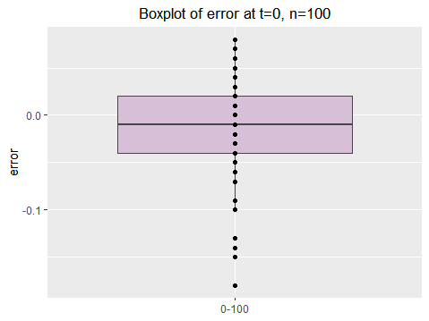

plot11<-ggplot(data=A,aes(y=e1000_2,x="0.67-100"))+geom_boxplot(
    fill="thistle",colour="gray27")+geom_point()+
    labs(title="Boxplot of error at t=0.67, n=100",y="error",
         x=NULL)+theme(plot.title=element_text(size=13,hjust=0.5))
plot11

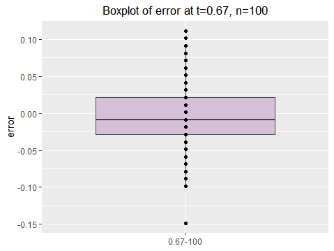

plot12<-ggplot(data=A,aes(y=e1000_3,x="0.84-100"))+geom_boxplot(
    fill="thistle",colour="gray27")+geom_point()+
    labs(title="Boxplot of error at t=0.84, n=100",y="error",
         x=NULL)+theme(plot.title=element_text(size=13,hjust=0.5))
plot12


plot13<-ggplot(data=A,aes(y=e1000_4,x="1.28-100"))+geom_boxplot(
    fill="thistle",colour="gray27")+geom_point()+
    labs(title="Boxplot of error at t=1.28, n=100",y="error",
         x=NULL)+theme(plot.title=element_text(size=13,hjust=0.5))
plot13

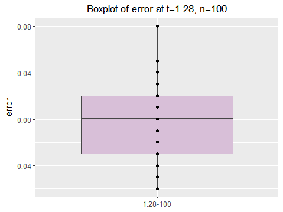

plot14<-ggplot(data=A,aes(y=e1000_5,x="1.65-100"))+geom_boxplot(
    fill="thistle",colour="gray27")+geom_point()+
    labs(title="Boxplot of error at t=1.65, n=100",y="error",
         x=NULL)+theme(plot.title=element_text(size=13,hjust=0.5))
plot14

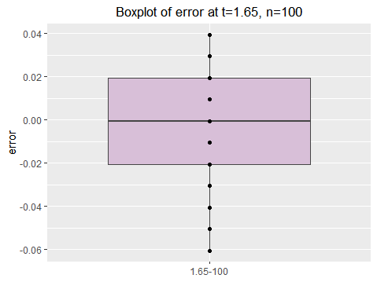

plot15<-ggplot(data=A,aes(y=e1000_6,x="2.32-100"))+geom_boxplot(
    fill="thistle",colour="gray27")+geom_point()+
    labs(title="Boxplot of error at t=2.32, n=100",y="error",
         x=NULL)+theme(plot.title=element_text(size=13,hjust=0.5))
plot15

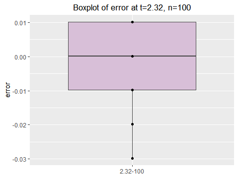

plot16<-ggplot(data=A,aes(y=e1000_7,x="2.58-100"))+geom_boxplot(
    fill="thistle",colour="gray27")+geom_point()+
    labs(title="Boxplot of error at t=2.58, n=100",y="error",
         x=NULL)+theme(plot.title=element_text(size=13,hjust=0.5))
plot16

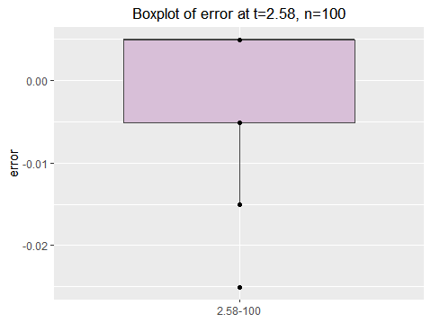

plot17<-ggplot(data=A,aes(y=e1000_8,x="3.09-100"))+geom_boxplot(
    fill="thistle",colour="gray27")+geom_point()+
    labs(title="Boxplot of error at t=3.09, n=100",y="error",
         x=NULL)+theme(plot.title=element_text(size=13,hjust=0.5))
plot17

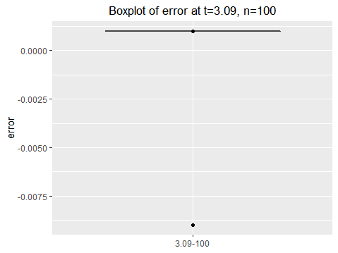

plot18<-ggplot(data=A,aes(y=e1000_9,x="3.72-100"))+geom_boxplot(
    fill="thistle",colour="gray27")+geom_point()+
    labs(title="Boxplot of error at t=3.72, n=100",y="error",
         x=NULL)+theme(plot.title=element_text(size=13,hjust=0.5))
plot18

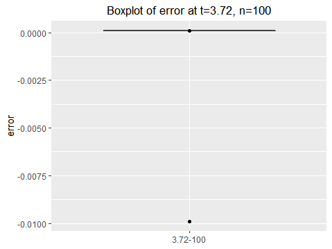

plot19<-ggplot(data=A,aes(y=e10000_1,x="0-100"))+geom_boxplot(
    fill="thistle",colour="gray27")+geom_point()+
    labs(title="Boxplot of error at t=0, n=100",y="error",
         x=NULL)+theme(plot.title=element_text(size=13,hjust=0.5))
plot19

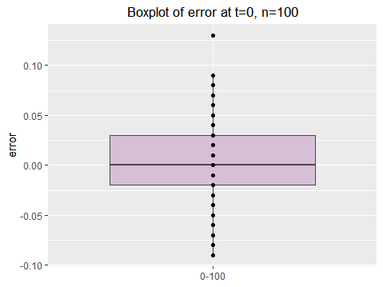

plot20<-ggplot(data=A,aes(y=e10000_2,x="0.67-100"))+geom_boxplot(
    fill="thistle",colour="gray27")+geom_point()+
    labs(title="Boxplot of error at t=0.67, n=100",y="error",
         x=NULL)+theme(plot.title=element_text(size=13,hjust=0.5))
plot20

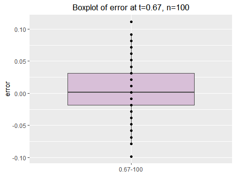

plot21<-ggplot(data=A,aes(y=e10000_3,x="0.84-100"))+geom_boxplot(
    fill="thistle",colour="gray27")+geom_point()+
    labs(title="Boxplot of error at t=0.84, n=100",y="error",
         x=NULL)+theme(plot.title=element_text(size=13,hjust=0.5))
plot21

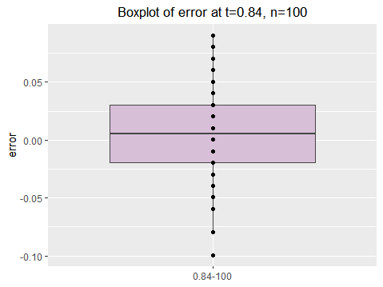

plot22<-ggplot(data=A,aes(y=e10000_4,x="1.28-100"))+geom_boxplot(
    fill="thistle",colour="gray27")+geom_point()+
    labs(title="Boxplot of error at t=1.28, n=100",y="error",
         x=NULL)+theme(plot.title=element_text(size=13,hjust=0.5))
plot22

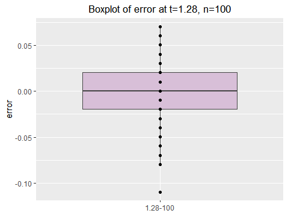

plot23<-ggplot(data=A,aes(y=e10000_5,x="1.65-100"))+geom_boxplot(
    fill="thistle",colour="gray27")+geom_point()+
    labs(title="Boxplot of error at t=1.65, n=100",y="error",
         x=NULL)+theme(plot.title=element_text(size=13,hjust=0.5))
plot23

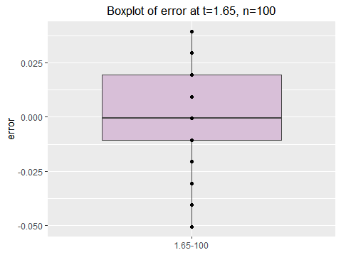

plot24<-ggplot(data=A,aes(y=e10000_6,x="2.32-100"))+geom_boxplot(
    fill="thistle",colour="gray27")+geom_point()+
    labs(title="Boxplot of error at t=2.32, n=100",y="error",
         x=NULL)+theme(plot.title=element_text(size=13,hjust=0.5))
plot24

knitr::include_graphics("plot/Rplot24.png")

plot25<-ggplot(data=A,aes(y=e10000_7,x="2.58-100"))+geom_boxplot(
    fill="thistle",colour="gray27")+geom_point()+
    labs(title="Boxplot of error at t=2.58, n=100",y="error",
         x=NULL)+theme(plot.title=element_text(size=13,hjust=0.5))
plot25


plot26<-ggplot(data=A,aes(y=e10000_8,x="3.09-100"))+geom_boxplot(
    fill="thistle",colour="gray27")+geom_point()+
    labs(title="Boxplot of error at t=3.09, n=100",y="error",
         x=NULL)+theme(plot.title=element_text(size=13,hjust=0.5))
plot26


plot27<-ggplot(data=A,aes(y=e10000_9,x="3.72-100"))+geom_boxplot(
    fill="thistle",colour="gray27")+geom_point()+
    labs(title="Boxplot of error at t=3.72, n=100",y="error",
         x=NULL)+theme(plot.title=element_text(size=13,hjust=0.5))
plot27


```

# Summary and Discussion {#sec:summary}

In this report, I formed a table that shows the difference between approximate value and true value, and draw the box plots of the 100 approximation errors which provides more intutive distinction.

